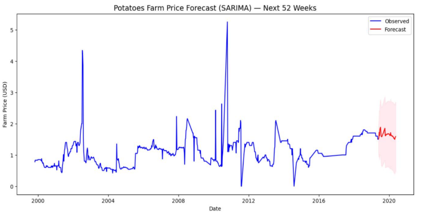
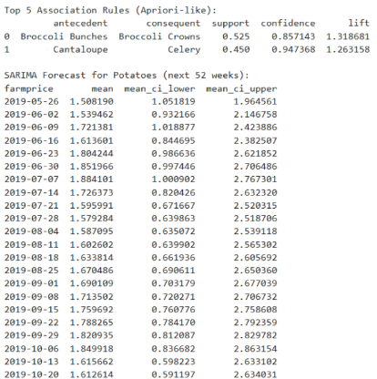

# Apriori-Arima-Vegetable-Price-Prediction

This project focuses on predicting vegetable prices using a hybrid approach combining the Apriori algorithm and ARIMA time series models. The Apriori algorithm is utilized for identifying frequent itemsets related to price movements or contributing factors, while ARIMA is employed for time series forecasting of the actual vegetable prices. This combined methodology aims to leverage both association rules and historical price trends for more accurate predictions.

## Table of Contents
- [Introduction](#introduction)
- [Features](#features)
- [Methodology](#methodology)
- [Installation](#installation)
- [Usage](#usage)
- [Results](#results)
- [Contributing](#contributing)

## Introduction

Accurate vegetable price prediction is crucial for farmers, consumers, and policymakers. Fluctuations in prices can significantly impact economic stability and food security. This project addresses this challenge by integrating two powerful analytical techniques: the Apriori algorithm for discovering associations and the ARIMA model for time series forecasting.

## Features

* **Data Preprocessing:** Handles and cleans historical vegetable price data.
* **Apriori Algorithm Implementation:** Identifies frequent patterns and association rules within the dataset, potentially revealing relationships between various factors and price changes.
* **ARIMA Model Integration:** Applies ARIMA for robust time series forecasting of vegetable prices.
* **Hybrid Approach:** Combines the insights from Apriori with the predictive power of ARIMA for potentially improved accuracy.
* **Visualization:** Provides visualizations of actual vs. predicted prices and other relevant data insights.

## Methodology

The project follows these key steps:

1.  **Data Collection:** Gathering historical vegetable price data from various sources (e.g., agricultural markets, government databases).
2.  **Data Preprocessing:** Cleaning, handling missing values, and transforming data into a suitable format for analysis.
3.  **Apriori Analysis:** Applying the Apriori algorithm to identify frequent itemsets and association rules. This might involve discretizing continuous price data or combining it with other categorical features (e.g., season, location, weather patterns if available).
4.  **ARIMA Modeling:** Building and training ARIMA models on the time series data of vegetable prices.
5.  **Prediction and Evaluation:** Generating price predictions and evaluating the model's performance using appropriate metrics (e.g., RMSE, MAE).
6.  **Integration (Optional but Recommended):** Exploring ways to incorporate the insights from Apriori (e.g., discovered rules or significant features) to enhance the ARIMA model's predictive capability or to provide context to the forecasts.

## Installation

To set up the project locally, follow these steps:

1.  **Clone the repository:**
    ```bash
    git clone [https://github.com/your-username/Apriori-Arima-Vegetable-Price-Prediction.git](https://github.com/your-username/Apriori-Arima-Vegetable-Price-Prediction.git)
    cd Apriori-Arima-Vegetable-Price-Prediction
    ```
2.  **Create a virtual environment (recommended):**
    ```bash
    python -m venv venv
    source venv/bin/activate  # On Windows, use `venv\Scripts\activate`
    ```
3.  **Install the required packages:**
    ```bash
    pip install -r requirements.txt
    ```
    *(Note: You'll need to create a `requirements.txt` file by running `pip freeze > requirements.txt` after installing all necessary libraries like `pandas`, `numpy`, `scikit-learn`, `statsmodels`, `mlxtend`, `matplotlib`, `seaborn`.)*

## Usage

1.  **Prepare your data:** Ensure your historical vegetable price data is in a CSV format, similar to the `data/vegetable_prices.csv` (you might need to create this `data` folder and place your CSV there).
2.  **Run the main prediction script:**
    ```bash
    python main.py
    ```
    *(Replace `main.py` with the actual name of your primary script that orchestrates the Apriori and ARIMA processes.)*
3.  **Explore the results:** Output predictions and visualizations will be generated (e.g., in a `results` folder or displayed directly).

## Results

Here, you will showcase the key findings and visualizations from your project.

### Overall Prediction Performance

* **Description:** Briefly explain what this graph shows (e.g., comparison of actual vs. predicted prices over time).
* **Image:**
    
    *Caption: A plot showing the actual vegetable prices compared against the prices predicted by the hybrid Apriori-ARIMA model.*

### ARIMA Model Forecast

* **Description:** Detail the ARIMA model's performance, perhaps focusing on a specific vegetable or time period.
* **Image:**
    
    *Caption: Time series forecast generated by the ARIMA model, showing future price trends with confidence intervals.*

### Apriori Association Rules

* **Description:** Illustrate some of the significant association rules discovered by the Apriori algorithm. You might show a table or a visualization of rule support, confidence, and lift.
* **Image (Example Table or Visualization):**
    
    *Caption: A visualization or table highlighting key association rules found by the Apriori algorithm, such as "If (Onion Price High) AND (Tomato Price High) THEN (Potato Price Tends to Increase)."*

### Error Metrics

* **Description:** Present a summary of the model's error metrics (e.g., RMSE, MAE, R-squared).
* **Image (Optional - a simple table in markdown might suffice):**
    ```
    | Metric | Value |
    |--------|-------|
    | RMSE   | 15.23 |
    | MAE    | 11.50 |
    | R-squared| 0.89  |
    ```
    *Caption: Performance metrics for the price prediction model.*

## Contributing

Contributions are welcome! If you have suggestions for improvements, new features, or bug fixes, please open an issue or submit a pull request.

1.  Fork the repository.
2.  Create your feature branch (`git checkout -b feature/AmazingFeature`).
3.  Commit your changes (`git commit -m 'Add some AmazingFeature'`).
4.  Push to the branch (`git push origin feature/AmazingFeature`).
5.  Open a Pull Request.
